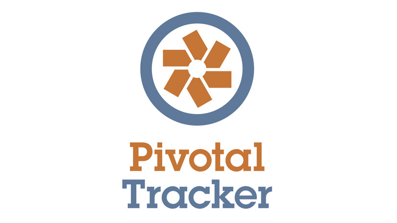

# mbti-frontend

This application is hosted by Netlify
[](https://app.netlify.com/sites/mbti-frontend/deploys)

=========================================================================

## Project Management

The Project is managed using [Pivotal Tracker](https://www.pivotaltracker.com/n/projects/2486976)



## Project setup with Docker

```
clone the repository
```

Run the Docker build command
```
docker build -t mbti-frontend .
```

## Project setup without Docker
```
yarn install
```

### Compiles and hot-reloads for development
```
yarn serve
```

### Compiles and minifies for production
```
yarn build
```

### Run your end-to-end tests
```
yarn test:e2e
```

### Lints and fixes files
```
yarn lint
```